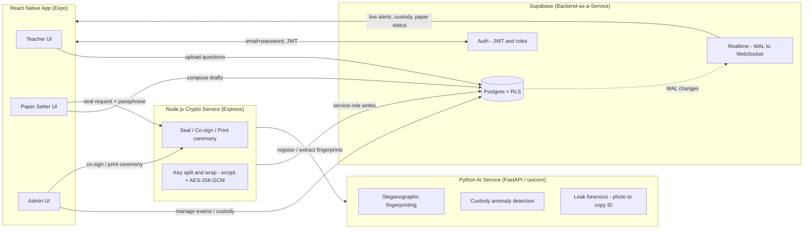
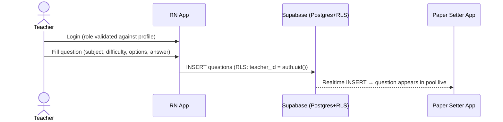
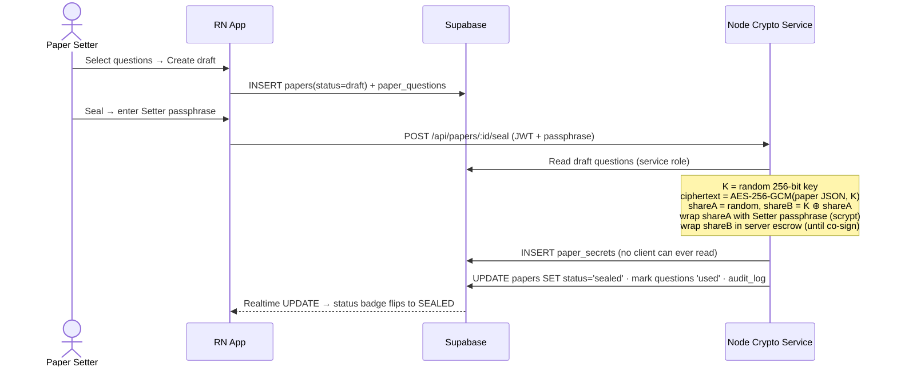
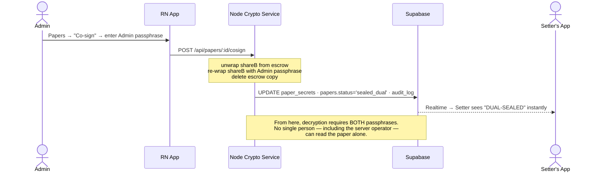
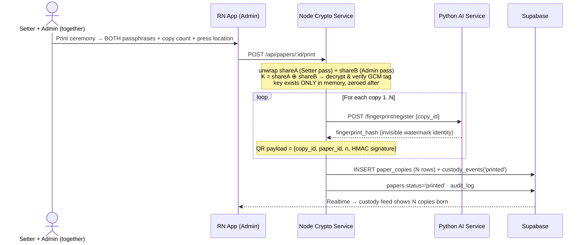
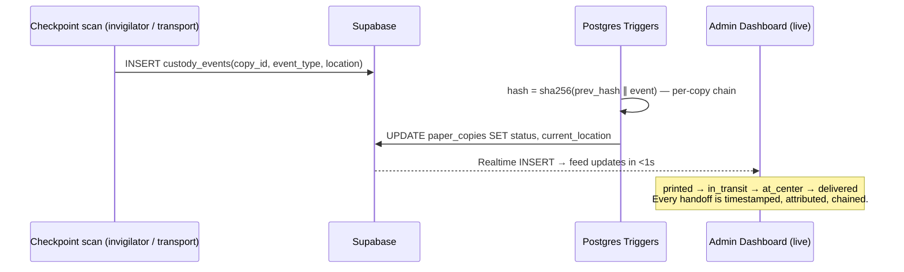
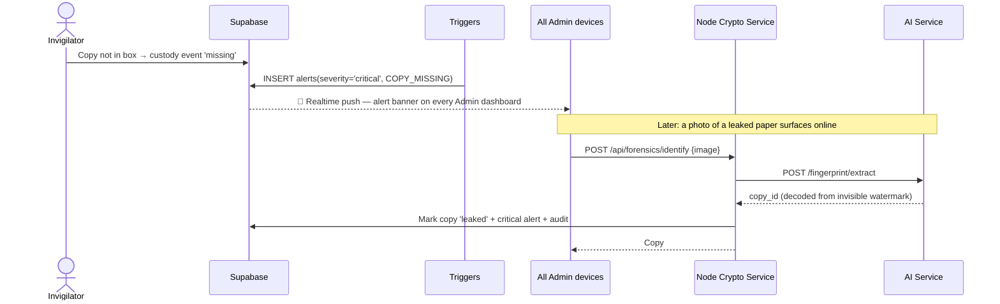

# SecureAIExam — Real-Time Architecture

A national-scale, end-to-end secure examination platform that eliminates question paper leaks by removing every single point of failure: cryptographic dual control, per-copy forensic identity, real-time chain of custody, and tamper-evident audit logging.

---

## 1. Design Principles

| Principle | Implementation |
|---|---|
| **No single person can access the paper** | Paper is sealed with AES-256-GCM; the key is split into two shares — one held by the Paper Setter, one by the Admin. Both passphrases are required to reconstruct the key. |
| **Every printed copy has a unique identity** | Visible: signed QR payload per copy. Invisible: steganographic fingerprint embedded by the AI service. |
| **Physical custody is tracked in real time** | Every checkpoint scan inserts a `custody_events` row; Supabase Realtime pushes it to the Admin dashboard over WebSockets within milliseconds. |
| **Missing papers trigger instant alerts** | A `missing`/`leaked` custody event fires a Postgres trigger that inserts a `critical` alert, which is streamed live to every Admin device. |
| **Leak source is identifiable from a photo** | AI service extracts the steganographic fingerprint → maps to copy ID → full custody chain shows who held it last. |
| **Accountability can never be disputed** | `audit_log` and `custody_events` are hash-chained (each row's hash covers the previous row's hash) — any tampering breaks the chain. |

---

## 2. System Components

**Why three services?**

- **Supabase** owns identity, data, row-level security, and the realtime fan-out. The mobile app talks to it directly for everything that is safe to do client-side.
- **Node crypto service** owns every operation that must *never* run on a client: key generation, key splitting, share wrapping, decryption ceremonies. It uses the Supabase *service-role* key and writes audit entries for every action.
- **Python AI service** owns the ML/forensics surface: invisible watermark embed/extract and custody anomaly scoring. Isolated so it can scale independently on exam day.

---

## 3. Roles & Access Matrix (enforced by Postgres RLS)

| Capability | Teacher | Paper Setter | Admin |
|---|:---:|:---:|:---:|
| Upload questions | ✅ (own) | — | — |
| View question pool | own only | ✅ all | ✅ all |
| Approve questions | — | ✅ | ✅ |
| Compose draft papers | — | ✅ (own) | — |
| Seal paper (share 1 of key) | — | ✅ | — |
| Co-sign paper (share 2 of key) | — | — | ✅ |
| Print ceremony (needs BOTH passphrases) | — | participates | ✅ initiates |
| View papers | — | own | ✅ all |
| Manage exams | — | — | ✅ |
| Scan custody checkpoints | — | — | ✅ (invigilators in production) |
| View live alerts / custody / audit log | — | — | ✅ |
| Read sealed paper content | ❌ nobody — requires both passphrases in the print ceremony | | |

---

## 4. Data Model

| Table | Purpose | Realtime? |
|---|---|:---:|
| `profiles` | User → role mapping (`teacher`, `paper_setter`, `admin`), created by trigger on signup | — |
| `questions` | Question bank uploaded by teachers (`submitted → approved → used`) | ✅ INSERT |
| `papers` | Paper lifecycle: `draft → sealed → sealed_dual → printed` | ✅ UPDATE |
| `paper_questions` | Which questions are in which paper (draft stage) | — |
| `paper_secrets` | Ciphertext + wrapped key shares. **No RLS policies → invisible to all clients; service-role only.** | — |
| `exams` | Exam scheduling, paper assignment | — |
| `paper_copies` | One row per printed copy: copy number, signed QR payload, fingerprint hash, live status/location | — |
| `custody_events` | Hash-chained checkpoint scans per copy (`printed → in_transit → at_center → delivered`, or `missing`/`leaked`) | ✅ INSERT |
| `alerts` | Real-time alerts (severity `info`/`warning`/`critical`) | ✅ INSERT |
| `audit_log` | Hash-chained, append-only record of every sensitive action | — |

---

## 5. Real-Time Architecture

Supabase Realtime tails the Postgres write-ahead log (WAL) and fans out changes over WebSockets. **RLS policies are evaluated per subscriber**, so an Admin's JWT receives alert rows while a Teacher's JWT receives nothing — the security model is identical for REST and realtime.

| Channel | Table / event | Subscriber | Powers |
|---|---|---|---|
| `alerts-admin` | `alerts` INSERT | Admin | Live alert feed on dashboard (missing copy → red banner in <1s) |
| `custody-live` | `custody_events` INSERT | Admin | Live chain-of-custody feed |
| `papers-setter-{id}` | `papers` UPDATE (filtered `setter_id=eq.{id}`) | Paper Setter | Setter sees status flip to *Dual-Sealed* the moment Admin co-signs |
| `questions-pool` | `questions` INSERT | Paper Setter | New teacher uploads appear in the pool live |

---

## 6. End-to-End Flows

### Flow A — Question Intake (Teacher)

### Flow B — Compose & Seal (Paper Setter, share 1 of 2)

### Flow C — Co-Sign (Admin, share 2 of 2 → dual control complete)

### Flow D — Print Ceremony & Fingerprinting (two-person rule)

### Flow E — Real-Time Chain of Custody

### Flow F — Missing Copy / Leak Forensics

---

## 7. Cryptography Details

**Sealing (dual control):**
- `K` = 32 random bytes (AES-256-GCM key), generated server-side, never persisted.
- `shareA` = 32 random bytes → wrapped with the **Setter's passphrase** (scrypt N=16384 → AES-256-GCM).
- `shareB` = `K ⊕ shareA` → held in **server escrow** until the Admin co-signs, then re-wrapped with the **Admin's passphrase** and the escrow copy destroyed.
- XOR splitting is information-theoretically secure: one share reveals *zero* bits of `K`.

**Per-copy identity:**
- QR payload: `{copy_id, paper_id, copy_number, sig}` where `sig = HMAC-SHA256(server_secret, …)` — forged QR codes fail verification.
- Fingerprint: AI service derives `HMAC(ai_secret, copy_id)` and can embed `copy_id` into page images via LSB steganography (demo) — production would use DCT/DWT watermarks that survive print-photograph round trips.

**Tamper evidence:**
- `audit_log.hash = sha256(prev_hash ∥ actor ∥ action ∥ entity ∥ details ∥ timestamp)` — a global chain.
- `custody_events` chains the same way **per copy**. Rewriting history requires recomputing every subsequent hash, which the append-only RLS policy prevents.

**Demo trade-offs (be honest about these):**
1. Between *seal* and *co-sign*, `shareB` sits in server escrow — so Setter + server collusion is theoretically possible in that window. Production: encrypt `shareB` directly to an Admin hardware token (or true Shamir t-of-n with an HSM ceremony), so the window never exists.
2. Question plaintext remains in `questions` (status `used`) for reuse in mock exams; production would purge or re-encrypt the bank after sealing.
3. LSB steganography does not survive JPEG/print-photo; production uses robust frequency-domain watermarking.
4. Roles are self-selected at signup for demo convenience; production is invite-only provisioning by the board.

---

## 8. Threat → Mitigation Map

| Threat | Mitigation |
|---|---|
| Insider (setter/admin/printer) opens paper early | Dual-control key split — no single passphrase decrypts anything |
| Database breach | `paper_secrets` holds only ciphertext + passphrase-wrapped shares; RLS hides it from every client JWT |
| Stolen copy in transit | Per-copy custody chain → missed checkpoint = instant critical alert with last known holder |
| Leaked photo on social media | Invisible fingerprint → exact copy → exact custody trail → exact person |
| Forged "official" paper copies | QR payloads are HMAC-signed; verification fails for fakes |
| Log tampering to hide involvement | Hash-chained, append-only audit log; any edit breaks every later hash |
| Client app tampering | All authorization is server-side (RLS + JWT role checks); the app is untrusted |

---

## 9. Scale Notes (national exam day)

- **Reads/scans:** custody scans are single-row inserts — Postgres handles tens of thousands/min; partition `custody_events` by exam for archives.
- **Realtime fan-out:** Supabase Realtime multiplexes WebSockets; admin dashboards subscribe to filtered channels only.
- **AI service:** stateless FastAPI → horizontal scale behind a load balancer; fingerprint registration is precomputed at print time, not on the hot path.
- **Crypto service:** stateless except Supabase I/O; ceremonies are rare events (per paper, not per copy).
